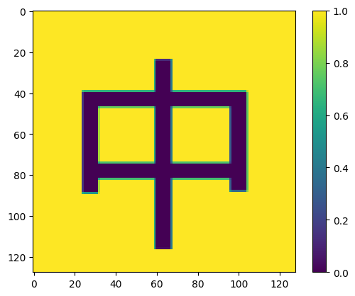
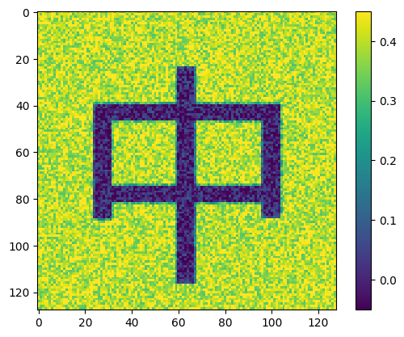
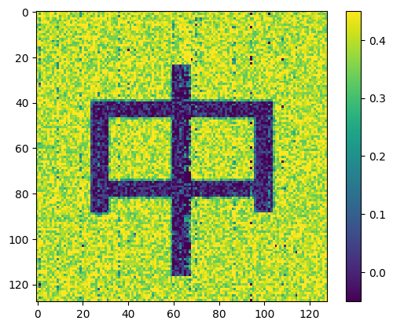
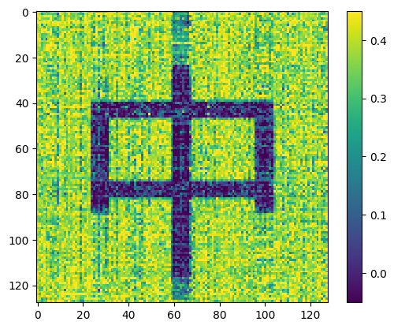
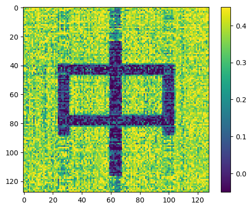
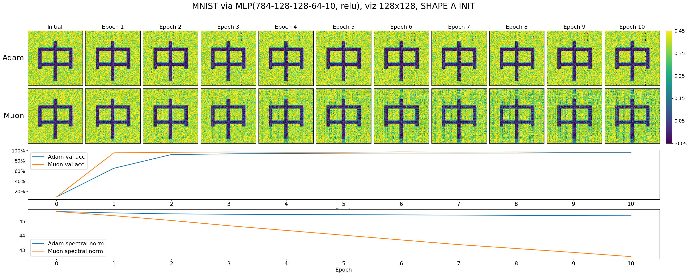
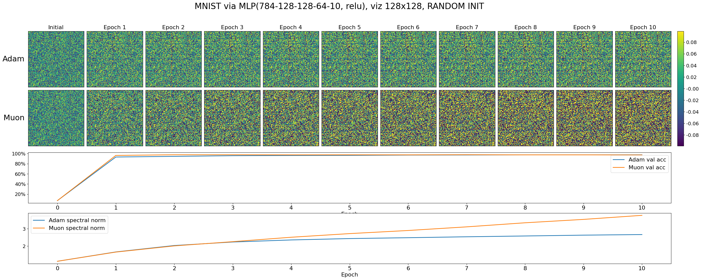

```python
%matplotlib inline
import os
os.environ["CUDA_VISIBLE_DEVICES"] = "5"
import torch
import matplotlib.pyplot as plt

# -----------------------------------------------------------------------------
# Muon optimizer

def zeropower_via_svd(G, steps=None):
    U, S, V = G.svd()
    return U @ V.T

@torch.compile
def zeropower_via_newtonschulz5(G, steps=10, eps=1e-7):
    r"""
    Newton-Schulz iteration to compute the zeroth power / orthogonalization of G. We opt to use a
    quintic iteration whose coefficients are selected to maximize the slope at zero. For the purpose
    of minimizing steps, it turns out to be empirically effective to keep increasing the slope at
    zero even beyond the point where the iteration no longer converges all the way to one everywhere
    on the interval. This iteration therefore does not produce UV^T but rather something like US'V^T
    where S' is diagonal with S_{ii}' \sim Uniform(0.5, 1.5), which turns out not to hurt model
    performance at all relative to UV^T, where USV^T = G is the SVD.
    """
    assert len(G.shape) == 2
    a, b, c = (3.4445, -4.7750,  2.0315)
    X = G.bfloat16() / (G.norm() + eps) # ensure top singular value <= 1
    if G.size(0) > G.size(1):
        X = X.T
    for _ in range(steps):
        A = X @ X.T
        B = A @ X
        X = a * X + b * B + c * A @ B
    if G.size(0) > G.size(1):
        X = X.T
    return X.to(G.dtype)

zeropower_backends = dict(svd=zeropower_via_svd, newtonschulz5=zeropower_via_newtonschulz5)

class Muon(torch.optim.Optimizer):
    r"""
    Muon - MomentUm Orthogonalized by Newton-schulz

    Muon internally runs standard SGD-momentum, and then performs an orthogonalization post-
    processing step, in which each 2D parameter's update is replaced with the nearest orthogonal
    matrix. To efficiently orthogonalize each update, we use a Newton-Schulz iteration, which has
    the advantage that it can be stably run in bfloat16 on the GPU.

    Some warnings:
    - This optimizer assumes that all parameters passed in are 2D.
    - It should not be used for the embedding layer, the final fully connected layer, or any {0,1}-D
    parameters; those should all be optimized by a standard method (e.g., AdamW).
    - To use it with 4D convolutional filters, it works well to just flatten their last 3 dimensions.
    - We believe it is unlikely to work well for training with small batch size.
    - We believe it may not work well for finetuning pretrained models, but we haven't tested this.
    - We have not yet tried this optimizer for training scenarios larger than NanoGPT (124M).

    Arguments:
        lr: The learning rate used by the internal SGD.
        momentum: The momentum used by the internal SGD.
        nesterov: Whether to use Nesterov-style momentum in the internal SGD. (recommended)
        backend: The chosen backend for the orthogonalization step. (recommended: 'newtonschulz5')
        backend_steps: The number of iteration steps to use in the backend, if it is iterative.
    """
    def __init__(self, params, lr=3e-4, momentum=0.95, nesterov=True, backend='newtonschulz5', backend_steps=5):
        defaults = dict(lr=lr, momentum=momentum, nesterov=nesterov, backend=backend, backend_steps=backend_steps)
        super().__init__(params, defaults)

    def step(self):
        for group in self.param_groups:
            lr = group['lr']
            momentum = group['momentum']
            zeropower_backend = zeropower_backends[group['backend']]
            for p in group['params']:
                g = p.grad
                if g is None:
                    continue
                state = self.state[p]
                if 'momentum_buffer' not in state:
                    state['momentum_buffer'] = torch.zeros_like(g)
                buf = state['momentum_buffer']
                buf.mul_(momentum).add_(g)
                if group['nesterov']:
                    g = g.add(buf, alpha=momentum)
                if g.size(0) == 3 * g.size(1): # split grouped QKV parameters; following @bozavlado's finding
                    g = torch.cat([zeropower_backend(g1, steps=group['backend_steps']) for g1 in g.split(g.size(1))])
                    scale = g.size(1)**0.5
                else:
                    g = zeropower_backend(g, steps=group['backend_steps'])
                    scale = max(g.size(0), g.size(1))**0.5 # scale to have update.square().mean() == 1
                p.data.add_(g, alpha=-lr * scale)
```


```python
# mnist training loop
from typing import Optional
import torch
import torch.nn as nn
import torch.optim as optim
from torchvision import datasets, transforms
from torch.utils.data import DataLoader
from collections import namedtuple

def train_mnist(model, opt, num_epochs=10, batch_size=512, w_save_key: Optional[str] = None):
    # Hyperparameters
    learning_rate = 0.001
    # device = torch.device("mps" if torch.backends.mps.is_available() else "cuda" if torch.cuda.is_available() else "cpu")
    device = torch.device("cuda" if torch.cuda.is_available() else "cpu")
    dtype = next(iter(model.parameters())).dtype
    print(f'training on {device}, {dtype}')

    # Data loading
    transform = transforms.Compose([
        transforms.ToTensor(),
        transforms.Normalize((0.1307,), (0.3081,))
    ])

    train_dataset = datasets.MNIST(root='./mnist_data', train=True, download=True, transform=transform)
    train_loader = DataLoader(train_dataset, batch_size=batch_size, shuffle=True)

    test_dataset = datasets.MNIST(root='./mnist_data', train=False, download=True, transform=transform)
    test_loader = DataLoader(test_dataset, batch_size=batch_size * 2, shuffle=False)

    # Assuming model is already defined and named "model"
    model = model.to(device)
    criterion = nn.CrossEntropyLoss()
    optimizers = []
    if opt == 'adam':
        optimizers.append(
            optim.Adam(model.parameters(), lr=learning_rate)  # Using Adam optimizer
        )
    elif opt == 'muon':
        optimizers.extend([
            Muon([p for p in model.parameters() if len(p.data.shape) == 2], lr=learning_rate),
            optim.Adam([p for p in model.parameters() if len(p.data.shape) != 2], lr=learning_rate),
        ])
    else:
        raise ValueError(f"Unknown optimizer: {opt}")

    @torch.no_grad()
    def evaluate(model, loader):
        model.eval()
        correct = 0
        total = 0
        for data, target in loader:
            data, target = data.to(device, dtype), target.to(device)
            output = model(data.flatten(1))
            _, predicted = torch.max(output.data, 1)
            total += target.size(0)
            correct += (predicted == target).sum().item()
        return correct / total

    # Training loop
    model_ws = []
    train_accs = []
    eval_accs = []

    def record():
        train_acc = evaluate(model, train_loader)
        eval_acc = evaluate(model, test_loader)
        eval_accs.append(eval_acc)
        train_accs.append(train_acc)
        if w_save_key is not None:
            model_ws.append(
                model.state_dict()[w_save_key].to('cpu', torch.float32).data
            )
        print(f"Epoch {len(eval_accs)-1}/{num_epochs}, Train Accuracy: {train_acc:.2%}, Test Accuracy: {eval_acc:.2%}")
        print('-' * 100)

    record()

    for epoch in range(num_epochs):
        model.train()
        for batch_idx, (data, target) in enumerate(train_loader):
            data, target = data.to(device, dtype), target.to(device)

            model.zero_grad()
            output = model(data.flatten(1))
            loss = criterion(output, target)
            loss.backward()
            for optimizer in optimizers:
                optimizer.step()

            if batch_idx % 200 == 0:
                print(f"Epoch {epoch+1}/{num_epochs}, Batch {batch_idx}/{len(train_loader)}, Loss: {loss.item():.4f}")

        record()

    print("Training completed!")

    return namedtuple('TrainResult', ['train_accs', 'eval_accs', 'model_ws'])(train_accs, eval_accs, model_ws)

```


```python
from matplotlib import font_manager
print(font_manager.get_font_names())
print(font_manager.findfont("DejaVu Sans Display"))
```

    ['Z003', 'C059', 'Latin Modern Math', 'DejaVu Sans Display', 'TeX Gyre Heros Cn', 'Latin Modern Mono', 'TeX Gyre DejaVu Math', 'STIXSizeTwoSym', 'Standard Symbols PS', 'TeX Gyre Pagella Math', 'Noto Mono', 'STIXSizeThreeSym', 'TeX Gyre Heros', 'cmex10', 'Latin Modern Roman Dunhill', 'TeX Gyre Bonum', 'Latin Modern Mono Prop', 'Nimbus Sans Narrow', 'Latin Modern Roman Demi', 'TeX Gyre Termes Math', 'TeX Gyre Termes', 'Latin Modern Roman Unslanted', 'cmb10', 'DejaVu Sans Mono', 'Latin Modern Roman', 'TeX Gyre Chorus', 'Droid Sans Fallback', 'cmsy10', 'Latin Modern Mono Light Cond', 'Latin Modern Mono Caps', 'Nimbus Mono PS', 'STIXSizeOneSym', 'Lato', 'Latin Modern Sans Quotation', 'cmr10', 'TeX Gyre Schola', 'cmmi10', 'TeX Gyre Pagella', 'Nimbus Sans', 'cmtt10', 'Noto Sans Mono', 'D050000L', 'Latin Modern Mono Prop Light', 'Latin Modern Roman Caps', 'cmss10', 'STIXNonUnicode', 'DejaVu Serif Display', 'Latin Modern Mono Light', 'TeX Gyre Bonum Math', 'Latin Modern Roman Slanted', 'URW Bookman', 'STIXGeneral', 'URW Gothic', 'STIXSizeFiveSym', 'Latin Modern Sans', 'DejaVu Math TeX Gyre', 'Latin Modern Sans Demi Cond', 'Nimbus Roman', 'TeX Gyre Cursor', 'Latin Modern Mono Slanted', 'DejaVu Serif', 'STIXSizeFourSym', 'P052', 'DejaVu Sans', 'TeX Gyre Adventor', 'TeX Gyre Schola Math']
    /data/home_mount/zhangfaen/miniconda3/envs/qwen2-VL/lib/python3.10/site-packages/matplotlib/mpl-data/fonts/ttf/DejaVuSansDisplay.ttf
    ['BytesIO', 'FontEntry', 'FontManager', 'FontProperties', 'MSFolders', 'MSFontDirectories', 'MSUserFontDirectories', 'Number', 'OSXFontDirectories', 'Path', 'X11FontDirectories', '_ExceptionProxy', '_HOME', '_JSONEncoder', '__builtins__', '__cached__', '__doc__', '__file__', '__loader__', '__name__', '__package__', '__spec__', '_afm', '_api', '_cached_realpath', '_get_font', '_get_fontconfig_fonts', '_get_macos_fonts', '_get_win32_installed_fonts', '_json_decode', '_load_fontmanager', '_log', '_validators', '_weight_regexes', 'afmFontProperty', 'annotations', 'b64encode', 'cbook', 'copy', 'dataclasses', 'findSystemFonts', 'findfont', 'fontManager', 'font_family_aliases', 'font_scalings', 'ft2font', 'generate_fontconfig_pattern', 'get_font', 'get_font_names', 'get_fontext_synonyms', 'is_opentype_cff_font', 'json', 'json_dump', 'json_load', 'list_fonts', 'logging', 'lru_cache', 'mpl', 'namedtuple', 'os', 'parse_fontconfig_pattern', 'plistlib', 're', 'stretch_dict', 'subprocess', 'sys', 'threading', 'ttfFontProperty', 'weight_dict', 'win32FontDirectory']


```python
from matplotlib import font_manager
# convert letter a in font to matrix indicator
def letter_a_to_matrix(size=10):
    import numpy as np
    from PIL import Image, ImageDraw, ImageFont

    # Create a blank image
    img = Image.new('L', (size, size), color=255)
    draw = ImageDraw.Draw(img)

    ratio_text_to_image = 0.8

    try:
        # "Droid Sans Fallback" is Android system fall back font, which has Chinese characters.
        font = ImageFont.truetype(font_manager.findfont('Droid Sans Fallback'), size*ratio_text_to_image)
    except IOError:
        print("here")
        font = ImageFont.load_default()

    print(font)
    # Draw the letter 'a'
    draw.text((size*(1-ratio_text_to_image)/2, 0), '中', align='center', font=font, fill=0)

    # Convert to numpy array
    matrix = np.array(img)

    # Convert to binary (0 and 1)
    # matrix = (matrix < 128).astype(int)
    print(matrix.shape)
    return matrix

a_matrix_128 = letter_a_to_matrix(128) / 255.

plt.imshow(a_matrix_128, interpolation='nearest')
plt.colorbar()
plt.show()
```

    <PIL.ImageFont.FreeTypeFont object at 0x14fca0911d50>
    (128, 128)


    

    


```python
model = nn.Sequential(
    nn.Linear(28*28, 128),
    nn.ReLU(),
    nn.Linear(128, 128),
    nn.ReLU(),
    nn.Linear(128, 64),
    nn.ReLU(),
    nn.Linear(64, 10),
).to(torch.bfloat16)

model = torch.compile(model)

random_init_weights = {k: v.clone().detach() for k, v in model.state_dict().items()}
model._orig_mod[2].weight.data += torch.as_tensor(a_matrix_128).float() * 0.4
a_matrix_weights = {k: v.clone().detach() for k, v in model.state_dict().items()}

viz_w_fn = lambda w: plt.imshow(w.to('cpu', torch.float32).data, vmin=-0.05, vmax=0.45, interpolation='nearest') and plt.colorbar() and plt.show()
viz_sd_fn = lambda sd: viz_w_fn(sd['_orig_mod.2.weight'])
```


```python
viz_sd_fn(a_matrix_weights)
```


    

    


```python
model.load_state_dict(random_init_weights)
rand_adam_res = train_mnist(model, opt='adam', w_save_key='_orig_mod.2.weight')

rand_adam_trained_weights = {k: v.clone().detach() for k, v in model.state_dict().items()}
```

    training on cuda, torch.bfloat16
    Epoch 0/10, Train Accuracy: 7.45%, Test Accuracy: 7.14%
    ----------------------------------------------------------------------------------------------------
    Epoch 1/10, Batch 0/118, Loss: 2.3125
    Epoch 1/10, Train Accuracy: 92.92%, Test Accuracy: 93.13%
    ----------------------------------------------------------------------------------------------------
    Epoch 2/10, Batch 0/118, Loss: 0.2656
    Epoch 2/10, Train Accuracy: 94.67%, Test Accuracy: 94.44%
    ----------------------------------------------------------------------------------------------------
    Epoch 3/10, Batch 0/118, Loss: 0.1816
    Epoch 3/10, Train Accuracy: 96.12%, Test Accuracy: 95.75%
    ----------------------------------------------------------------------------------------------------
    Epoch 4/10, Batch 0/118, Loss: 0.1416
    Epoch 4/10, Train Accuracy: 96.68%, Test Accuracy: 96.15%
    ----------------------------------------------------------------------------------------------------
    Epoch 5/10, Batch 0/118, Loss: 0.0957
    Epoch 5/10, Train Accuracy: 97.23%, Test Accuracy: 96.37%
    ----------------------------------------------------------------------------------------------------
    Epoch 6/10, Batch 0/118, Loss: 0.1250
    Epoch 6/10, Train Accuracy: 97.92%, Test Accuracy: 96.95%
    ----------------------------------------------------------------------------------------------------
    Epoch 7/10, Batch 0/118, Loss: 0.0586
    Epoch 7/10, Train Accuracy: 98.15%, Test Accuracy: 97.12%
    ----------------------------------------------------------------------------------------------------
    Epoch 8/10, Batch 0/118, Loss: 0.0479
    Epoch 8/10, Train Accuracy: 98.41%, Test Accuracy: 97.34%
    ----------------------------------------------------------------------------------------------------
    Epoch 9/10, Batch 0/118, Loss: 0.0522
    Epoch 9/10, Train Accuracy: 98.66%, Test Accuracy: 97.41%
    ----------------------------------------------------------------------------------------------------
    Epoch 10/10, Batch 0/118, Loss: 0.0311
    Epoch 10/10, Train Accuracy: 98.89%, Test Accuracy: 97.49%
    ----------------------------------------------------------------------------------------------------
    Training completed!


```python
model.load_state_dict(a_matrix_weights)
adam_res = train_mnist(model, opt='adam', w_save_key='_orig_mod.2.weight')

a_adam_trained_weights = {k: v.clone().detach() for k, v in model.state_dict().items()}
```

    training on cuda, torch.bfloat16
    Epoch 0/10, Train Accuracy: 9.04%, Test Accuracy: 8.92%
    ----------------------------------------------------------------------------------------------------
    Epoch 1/10, Batch 0/118, Loss: 3.6562
    Epoch 1/10, Train Accuracy: 64.81%, Test Accuracy: 65.24%
    ----------------------------------------------------------------------------------------------------
    Epoch 2/10, Batch 0/118, Loss: 1.0234
    Epoch 2/10, Train Accuracy: 92.13%, Test Accuracy: 92.07%
    ----------------------------------------------------------------------------------------------------
    Epoch 3/10, Batch 0/118, Loss: 0.3359
    Epoch 3/10, Train Accuracy: 93.82%, Test Accuracy: 93.41%
    ----------------------------------------------------------------------------------------------------
    Epoch 4/10, Batch 0/118, Loss: 0.2168
    Epoch 4/10, Train Accuracy: 94.67%, Test Accuracy: 94.35%
    ----------------------------------------------------------------------------------------------------
    Epoch 5/10, Batch 0/118, Loss: 0.1611
    Epoch 5/10, Train Accuracy: 95.16%, Test Accuracy: 94.81%
    ----------------------------------------------------------------------------------------------------
    Epoch 6/10, Batch 0/118, Loss: 0.2295
    Epoch 6/10, Train Accuracy: 95.59%, Test Accuracy: 95.01%
    ----------------------------------------------------------------------------------------------------
    Epoch 7/10, Batch 0/118, Loss: 0.1807
    Epoch 7/10, Train Accuracy: 95.69%, Test Accuracy: 94.93%
    ----------------------------------------------------------------------------------------------------
    Epoch 8/10, Batch 0/118, Loss: 0.1270
    Epoch 8/10, Train Accuracy: 96.05%, Test Accuracy: 95.08%
    ----------------------------------------------------------------------------------------------------
    Epoch 9/10, Batch 0/118, Loss: 0.1455
    Epoch 9/10, Train Accuracy: 96.42%, Test Accuracy: 95.73%
    ----------------------------------------------------------------------------------------------------
    Epoch 10/10, Batch 0/118, Loss: 0.1270
    Epoch 10/10, Train Accuracy: 96.69%, Test Accuracy: 95.77%
    ----------------------------------------------------------------------------------------------------
    Training completed!


```python
viz_sd_fn(a_adam_trained_weights)

```


    

    


```python
model.load_state_dict(a_matrix_weights)
muon_res = train_mnist(model, opt='muon', w_save_key='_orig_mod.2.weight')

a_muon_trained_weights = {k: v.clone().detach() for k, v in model.state_dict().items()}
```

    training on cuda, torch.bfloat16
    Epoch 0/10, Train Accuracy: 9.04%, Test Accuracy: 8.92%
    ----------------------------------------------------------------------------------------------------
    Epoch 1/10, Batch 0/118, Loss: 3.4844
    Epoch 1/10, Train Accuracy: 96.54%, Test Accuracy: 95.47%
    ----------------------------------------------------------------------------------------------------
    Epoch 2/10, Batch 0/118, Loss: 0.1030
    Epoch 2/10, Train Accuracy: 98.12%, Test Accuracy: 96.51%
    ----------------------------------------------------------------------------------------------------
    Epoch 3/10, Batch 0/118, Loss: 0.0542
    Epoch 3/10, Train Accuracy: 99.05%, Test Accuracy: 97.12%
    ----------------------------------------------------------------------------------------------------
    Epoch 4/10, Batch 0/118, Loss: 0.0245
    Epoch 4/10, Train Accuracy: 98.94%, Test Accuracy: 96.58%
    ----------------------------------------------------------------------------------------------------
    Epoch 5/10, Batch 0/118, Loss: 0.0374
    Epoch 5/10, Train Accuracy: 98.91%, Test Accuracy: 96.61%
    ----------------------------------------------------------------------------------------------------
    Epoch 6/10, Batch 0/118, Loss: 0.0283
    Epoch 6/10, Train Accuracy: 99.37%, Test Accuracy: 97.19%
    ----------------------------------------------------------------------------------------------------
    Epoch 7/10, Batch 0/118, Loss: 0.0244
    Epoch 7/10, Train Accuracy: 99.31%, Test Accuracy: 96.84%
    ----------------------------------------------------------------------------------------------------
    Epoch 8/10, Batch 0/118, Loss: 0.0225
    Epoch 8/10, Train Accuracy: 99.43%, Test Accuracy: 97.10%
    ----------------------------------------------------------------------------------------------------
    Epoch 9/10, Batch 0/118, Loss: 0.0461
    Epoch 9/10, Train Accuracy: 99.47%, Test Accuracy: 96.96%
    ----------------------------------------------------------------------------------------------------
    Epoch 10/10, Batch 0/118, Loss: 0.0108
    Epoch 10/10, Train Accuracy: 99.38%, Test Accuracy: 97.02%
    ----------------------------------------------------------------------------------------------------
    Training completed!


```python
model.load_state_dict(random_init_weights)
rand_muon_res = train_mnist(model, opt='muon', w_save_key='_orig_mod.2.weight')

rand_muon_trained_weights = {k: v.clone().detach() for k, v in model.state_dict().items()}
```

    training on cuda, torch.bfloat16
    Epoch 0/10, Train Accuracy: 7.45%, Test Accuracy: 7.14%
    ----------------------------------------------------------------------------------------------------
    Epoch 1/10, Batch 0/118, Loss: 2.3125
    Epoch 1/10, Train Accuracy: 97.12%, Test Accuracy: 96.25%
    ----------------------------------------------------------------------------------------------------
    Epoch 2/10, Batch 0/118, Loss: 0.1064
    Epoch 2/10, Train Accuracy: 98.86%, Test Accuracy: 97.58%
    ----------------------------------------------------------------------------------------------------
    Epoch 3/10, Batch 0/118, Loss: 0.0447
    Epoch 3/10, Train Accuracy: 99.24%, Test Accuracy: 97.61%
    ----------------------------------------------------------------------------------------------------
    Epoch 4/10, Batch 0/118, Loss: 0.0223
    Epoch 4/10, Train Accuracy: 99.18%, Test Accuracy: 97.37%
    ----------------------------------------------------------------------------------------------------
    Epoch 5/10, Batch 0/118, Loss: 0.0077
    Epoch 5/10, Train Accuracy: 99.19%, Test Accuracy: 97.49%
    ----------------------------------------------------------------------------------------------------
    Epoch 6/10, Batch 0/118, Loss: 0.0129
    Epoch 6/10, Train Accuracy: 99.42%, Test Accuracy: 97.40%
    ----------------------------------------------------------------------------------------------------
    Epoch 7/10, Batch 0/118, Loss: 0.0108
    Epoch 7/10, Train Accuracy: 99.47%, Test Accuracy: 97.68%
    ----------------------------------------------------------------------------------------------------
    Epoch 8/10, Batch 0/118, Loss: 0.0066
    Epoch 8/10, Train Accuracy: 99.37%, Test Accuracy: 97.38%
    ----------------------------------------------------------------------------------------------------
    Epoch 9/10, Batch 0/118, Loss: 0.0610
    Epoch 9/10, Train Accuracy: 99.48%, Test Accuracy: 97.37%
    ----------------------------------------------------------------------------------------------------
    Epoch 10/10, Batch 0/118, Loss: 0.0140
    Epoch 10/10, Train Accuracy: 99.53%, Test Accuracy: 97.14%
    ----------------------------------------------------------------------------------------------------
    Training completed!


```python
viz_sd_fn(a_muon_trained_weights)

```


    

    


```python
def matrix_spectral_norm(w):
    """
    Compute the spectral norm of a matrix using Singular Value Decomposition (SVD).

    Args:
    w (torch.Tensor): The input matrix

    Returns:
    float: The spectral norm of the matrix
    """
    if w.dim() > 2:
        w = w.view(w.size(0), -1)

    # Compute SVD
    _, s, _ = torch.svd(w)

    # The spectral norm is the largest singular value
    return s[0].item()


```


```python
fig, axes = plt.subplots(4, 11, figsize=(11 * 3, 4 * 3), gridspec_kw=dict(wspace=0.05, hspace=0.05))

# Remove the individual axes in the bottom half
for i in range(2, axes.shape[0]):
    for j in range(axes.shape[1]):
        fig.delaxes(axes[i, j])
bottom_ax = fig.add_subplot(4, 1, 3)
bottom2_ax = fig.add_subplot(4, 1, 4)

fig.suptitle('MNIST via MLP(784-128-128-64-10, relu), viz 128x128, SHAPE A INIT', fontsize=24, y=0.975)
axes[0, 0].set_ylabel('Adam', fontsize=22, rotation=0, ha='right', va='center', labelpad=10)
axes[1, 0].set_ylabel('Muon', fontsize=22, rotation=0, ha='right', va='center', labelpad=10)
for i, ax in enumerate(axes[0]):
    ax.set_title(f'Epoch {i}' if i > 0 else 'Initial', fontsize=16)
    ax.set_xticks([])
    ax.set_yticks([])
    ax.imshow(adam_res.model_ws[i].to('cpu', torch.float32).data, vmin=-0.05, vmax=0.45, interpolation='nearest')
for i, ax in enumerate(axes[1]):
    ax.set_xticks([])
    ax.set_yticks([])
    im = ax.imshow(muon_res.model_ws[i].to('cpu', torch.float32).data, vmin=-0.05, vmax=0.45, interpolation='nearest')

cax = fig.add_axes([axes[1, -1].get_position().x1+0.0075, axes[1, -1].get_position().y0, 0.0075, axes[0, -1].get_position().y1-axes[1, -1].get_position().y0])
cb = fig.colorbar(im, cax=cax, ticks=torch.linspace(-0.0499, 0.45, 6), format='%.2f')
cb.ax.tick_params(labelsize=14)

bottom_ax.plot(adam_res.eval_accs, label='Adam val acc', linewidth=2)
bottom_ax.plot(muon_res.eval_accs, label='Muon val acc', linewidth=2)
bottom_ax.set_xlabel('Epoch', fontsize=16)
bottom_ax.xaxis.set_ticks(range(len(adam_res.eval_accs)))
bottom_ax.xaxis.set_tick_params(labelsize=16)
bottom_ax.yaxis.set_tick_params(labelsize=14)
bottom_ax.legend(fontsize=16)
bottom_ax.yaxis.set_major_formatter(plt.FuncFormatter(lambda x, p: f"{x:.0%}"))

bottom2_ax.plot([matrix_spectral_norm(w) for w in adam_res.model_ws], label='Adam spectral norm', linewidth=2)
bottom2_ax.plot([matrix_spectral_norm(w) for w in muon_res.model_ws], label='Muon spectral norm', linewidth=2)
bottom2_ax.set_xlabel('Epoch', fontsize=16)
bottom2_ax.xaxis.set_ticks(range(len(adam_res.eval_accs)))
bottom2_ax.xaxis.set_tick_params(labelsize=16)
bottom2_ax.yaxis.set_tick_params(labelsize=14)
bottom2_ax.legend(fontsize=16)
# bottom2_ax.yaxis.set_major_formatter(plt.FuncFormatter(lambda x, p: f"{x:.0%}"))
# fig.tight_layout()
fig
```


    

    


    

    


```python
fig, axes = plt.subplots(4, 11, figsize=(11 * 3, 4 * 3), gridspec_kw=dict(wspace=0.05, hspace=0.05))

# Remove the individual axes in the bottom half
for i in range(2, axes.shape[0]):
    for j in range(axes.shape[1]):
        fig.delaxes(axes[i, j])
bottom_ax = fig.add_subplot(4, 1, 3)
bottom2_ax = fig.add_subplot(4, 1, 4)

fig.suptitle('MNIST via MLP(784-128-128-64-10, relu), viz 128x128, RANDOM INIT', fontsize=24, y=0.975)
axes[0, 0].set_ylabel('Adam', fontsize=22, rotation=0, ha='right', va='center', labelpad=10)
axes[1, 0].set_ylabel('Muon', fontsize=22, rotation=0, ha='right', va='center', labelpad=10)
vmin, vmax = -0.1, 0.1
for i, ax in enumerate(axes[0]):
    ax.set_title(f'Epoch {i}' if i > 0 else 'Initial', fontsize=16)
    ax.set_xticks([])
    ax.set_yticks([])
    ax.imshow(rand_adam_res.model_ws[i].to('cpu', torch.float32).data, vmin=vmin, vmax=vmax, interpolation='nearest')
for i, ax in enumerate(axes[1]):
    ax.set_xticks([])
    ax.set_yticks([])
    im = ax.imshow(rand_muon_res.model_ws[i].to('cpu', torch.float32).data, vmin=vmin, vmax=vmax, interpolation='nearest')

cax = fig.add_axes([axes[1, -1].get_position().x1+0.0075, axes[1, -1].get_position().y0, 0.0075, axes[0, -1].get_position().y1-axes[1, -1].get_position().y0])
cb = fig.colorbar(im, cax=cax, ticks=torch.linspace(vmin-0.001, vmax+0.001, 11), format='%.2f')
cb.ax.tick_params(labelsize=14)

bottom_ax.plot(rand_adam_res.eval_accs, label='Adam val acc', linewidth=2)
bottom_ax.plot(rand_muon_res.eval_accs, label='Muon val acc', linewidth=2)
bottom_ax.set_xlabel('Epoch', fontsize=16)
bottom_ax.xaxis.set_ticks(range(len(adam_res.eval_accs)))
bottom_ax.xaxis.set_tick_params(labelsize=16)
bottom_ax.yaxis.set_tick_params(labelsize=14)
bottom_ax.legend(fontsize=16)
bottom_ax.yaxis.set_major_formatter(plt.FuncFormatter(lambda x, p: f"{x:.0%}"))

bottom2_ax.plot([matrix_spectral_norm(w) for w in rand_adam_res.model_ws], label='Adam spectral norm', linewidth=2)
bottom2_ax.plot([matrix_spectral_norm(w) for w in rand_muon_res.model_ws], label='Muon spectral norm', linewidth=2)
bottom2_ax.set_xlabel('Epoch', fontsize=16)
bottom2_ax.xaxis.set_ticks(range(len(adam_res.eval_accs)))
bottom2_ax.xaxis.set_tick_params(labelsize=16)
bottom2_ax.yaxis.set_tick_params(labelsize=14)
bottom2_ax.legend(fontsize=16)
# fig.tight_layout()
fig
```


    

    


    

    


**Note** This repo is variant of https://gist.github.com/ssnl/8a67601b309a4b64ba4363b5e66fb1c8.   
Credits to Tongzhou Wang! Thank you for the great work!
