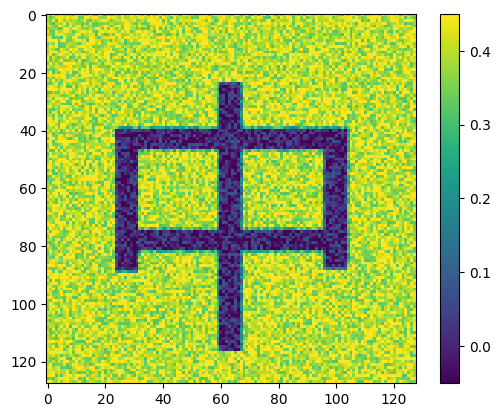

## Introduction
I recently came across a fascinating paper titled "Effect of the Initial Configuration of Weights on the Training and Function of Artificial Neural Networks" (https://arxiv.org/pdf/2012.02550). It clearly demonstrates the impact of the initial weight configuration on the performance and function of neural networks during the training process.

In simple terms, a neural network is like a complex machine with many "switches" (i.e., weights). These switches are randomly set at the beginning. During training, these settings are gradually adjusted, with the goal of enabling the network to produce the most accurate output possible.

Through their analysis, the authors found that when using common training methods (such as SGD/AdamW), the final state of the network often remains close to the initial configuration. It’s like the network is "fine-tuning" its initial state rather than completely resetting or rearranging all the switches.

Training algorithms generally don't need to venture too far from the initial settings—an optimal solution can often be found in the vicinity of the initial configuration.

## Create Environment

```bash
conda create -n effect python=3.10 -y
conda activate effect
pip install -r requirements.txt
```

## Run and enjoy below code cells


```python
%matplotlib inline
import os
os.environ["CUDA_VISIBLE_DEVICES"] = "5"
import torch
import matplotlib.pyplot as plt

# -----------------------------------------------------------------------------
# Muon optimizer

def zeropower_via_svd(G, steps=None):
    U, S, V = G.svd()
    return U @ V.T

@torch.compile
def zeropower_via_newtonschulz5(G, steps=10, eps=1e-7):
    r"""
    Newton-Schulz iteration to compute the zeroth power / orthogonalization of G. We opt to use a
    quintic iteration whose coefficients are selected to maximize the slope at zero. For the purpose
    of minimizing steps, it turns out to be empirically effective to keep increasing the slope at
    zero even beyond the point where the iteration no longer converges all the way to one everywhere
    on the interval. This iteration therefore does not produce UV^T but rather something like US'V^T
    where S' is diagonal with S_{ii}' \sim Uniform(0.5, 1.5), which turns out not to hurt model
    performance at all relative to UV^T, where USV^T = G is the SVD.
    """
    assert len(G.shape) == 2
    a, b, c = (3.4445, -4.7750,  2.0315)
    X = G.bfloat16() / (G.norm() + eps) # ensure top singular value <= 1
    if G.size(0) > G.size(1):
        X = X.T
    for _ in range(steps):
        A = X @ X.T
        B = A @ X
        X = a * X + b * B + c * A @ B
    if G.size(0) > G.size(1):
        X = X.T
    return X.to(G.dtype)

zeropower_backends = dict(svd=zeropower_via_svd, newtonschulz5=zeropower_via_newtonschulz5)

class Muon(torch.optim.Optimizer):
    r"""
    Muon - MomentUm Orthogonalized by Newton-schulz

    Muon internally runs standard SGD-momentum, and then performs an orthogonalization post-
    processing step, in which each 2D parameter's update is replaced with the nearest orthogonal
    matrix. To efficiently orthogonalize each update, we use a Newton-Schulz iteration, which has
    the advantage that it can be stably run in bfloat16 on the GPU.

    Some warnings:
    - This optimizer assumes that all parameters passed in are 2D.
    - It should not be used for the embedding layer, the final fully connected layer, or any {0,1}-D
    parameters; those should all be optimized by a standard method (e.g., AdamW).
    - To use it with 4D convolutional filters, it works well to just flatten their last 3 dimensions.
    - We believe it is unlikely to work well for training with small batch size.
    - We believe it may not work well for finetuning pretrained models, but we haven't tested this.
    - We have not yet tried this optimizer for training scenarios larger than NanoGPT (124M).

    Arguments:
        lr: The learning rate used by the internal SGD.
        momentum: The momentum used by the internal SGD.
        nesterov: Whether to use Nesterov-style momentum in the internal SGD. (recommended)
        backend: The chosen backend for the orthogonalization step. (recommended: 'newtonschulz5')
        backend_steps: The number of iteration steps to use in the backend, if it is iterative.
    """
    def __init__(self, params, lr=3e-4, momentum=0.95, nesterov=True, backend='newtonschulz5', backend_steps=5):
        defaults = dict(lr=lr, momentum=momentum, nesterov=nesterov, backend=backend, backend_steps=backend_steps)
        super().__init__(params, defaults)

    def step(self):
        for group in self.param_groups:
            lr = group['lr']
            momentum = group['momentum']
            zeropower_backend = zeropower_backends[group['backend']]
            for p in group['params']:
                g = p.grad
                if g is None:
                    continue
                state = self.state[p]
                if 'momentum_buffer' not in state:
                    state['momentum_buffer'] = torch.zeros_like(g)
                buf = state['momentum_buffer']
                buf.mul_(momentum).add_(g)
                if group['nesterov']:
                    g = g.add(buf, alpha=momentum)
                if g.size(0) == 3 * g.size(1): # split grouped QKV parameters; following @bozavlado's finding
                    g = torch.cat([zeropower_backend(g1, steps=group['backend_steps']) for g1 in g.split(g.size(1))])
                    scale = g.size(1)**0.5
                else:
                    g = zeropower_backend(g, steps=group['backend_steps'])
                    scale = max(g.size(0), g.size(1))**0.5 # scale to have update.square().mean() == 1
                p.data.add_(g, alpha=-lr * scale)
```


```python
# mnist training loop
from typing import Optional
import torch
import torch.nn as nn
import torch.optim as optim
from torchvision import datasets, transforms
from torch.utils.data import DataLoader
from collections import namedtuple

def train_mnist(model, opt, num_epochs=10, batch_size=512, w_save_key: Optional[str] = None):
    # Hyperparameters
    learning_rate = 0.001
    # device = torch.device("mps" if torch.backends.mps.is_available() else "cuda" if torch.cuda.is_available() else "cpu")
    device = torch.device("cuda" if torch.cuda.is_available() else "cpu")
    dtype = next(iter(model.parameters())).dtype
    print(f'training on {device}, {dtype}')

    # Data loading
    transform = transforms.Compose([
        transforms.ToTensor(),
        transforms.Normalize((0.1307,), (0.3081,))
    ])

    train_dataset = datasets.MNIST(root='./mnist_data', train=True, download=True, transform=transform)
    train_loader = DataLoader(train_dataset, batch_size=batch_size, shuffle=True)

    test_dataset = datasets.MNIST(root='./mnist_data', train=False, download=True, transform=transform)
    test_loader = DataLoader(test_dataset, batch_size=batch_size * 2, shuffle=False)

    # Assuming model is already defined and named "model"
    model = model.to(device)
    criterion = nn.CrossEntropyLoss()
    optimizers = []
    if opt == 'adam':
        optimizers.append(
            optim.Adam(model.parameters(), lr=learning_rate)  # Using Adam optimizer
        )
    elif opt == 'muon':
        optimizers.extend([
            Muon([p for p in model.parameters() if len(p.data.shape) == 2], lr=learning_rate),
            optim.Adam([p for p in model.parameters() if len(p.data.shape) != 2], lr=learning_rate),
        ])
    else:
        raise ValueError(f"Unknown optimizer: {opt}")

    @torch.no_grad()
    def evaluate(model, loader):
        model.eval()
        correct = 0
        total = 0
        for data, target in loader:
            data, target = data.to(device, dtype), target.to(device)
            output = model(data.flatten(1))
            _, predicted = torch.max(output.data, 1)
            total += target.size(0)
            correct += (predicted == target).sum().item()
        return correct / total

    # Training loop
    model_ws = []
    train_accs = []
    eval_accs = []

    def record():
        train_acc = evaluate(model, train_loader)
        eval_acc = evaluate(model, test_loader)
        eval_accs.append(eval_acc)
        train_accs.append(train_acc)
        if w_save_key is not None:
            model_ws.append(
                model.state_dict()[w_save_key].to('cpu', torch.float32).data
            )
        print(f"Epoch {len(eval_accs)-1}/{num_epochs}, Train Accuracy: {train_acc:.2%}, Test Accuracy: {eval_acc:.2%}")
        print('-' * 100)

    record()

    for epoch in range(num_epochs):
        model.train()
        for batch_idx, (data, target) in enumerate(train_loader):
            data, target = data.to(device, dtype), target.to(device)

            model.zero_grad()
            output = model(data.flatten(1))
            loss = criterion(output, target)
            loss.backward()
            for optimizer in optimizers:
                optimizer.step()

            if batch_idx % 200 == 0:
                print(f"Epoch {epoch+1}/{num_epochs}, Batch {batch_idx}/{len(train_loader)}, Loss: {loss.item():.4f}")

        record()

    print("Training completed!")

    return namedtuple('TrainResult', ['train_accs', 'eval_accs', 'model_ws'])(train_accs, eval_accs, model_ws)

```


```python
from matplotlib import font_manager
print(font_manager.get_font_names())
print(font_manager.findfont("DejaVu Sans Display"))
```

    ['cmb10', 'Latin Modern Roman Dunhill', 'Latin Modern Roman Demi', 'cmr10', 'TeX Gyre Heros', 'C059', 'Latin Modern Mono Prop Light', 'STIXSizeOneSym', 'DejaVu Serif Display', 'STIXNonUnicode', 'TeX Gyre Heros Cn', 'Z003', 'TeX Gyre Chorus', 'cmex10', 'DejaVu Math TeX Gyre', 'Latin Modern Mono Slanted', 'TeX Gyre Bonum Math', 'URW Gothic', 'Latin Modern Mono Light Cond', 'Latin Modern Sans Demi Cond', 'cmss10', 'STIXGeneral', 'cmtt10', 'Lato', 'TeX Gyre Pagella Math', 'Noto Mono', 'Nimbus Roman', 'Latin Modern Roman', 'Latin Modern Mono Prop', 'Latin Modern Mono Light', 'TeX Gyre DejaVu Math', 'Latin Modern Sans Quotation', 'STIXSizeFiveSym', 'TeX Gyre Termes', 'TeX Gyre Adventor', 'Latin Modern Math', 'cmsy10', 'Latin Modern Roman Slanted', 'Nimbus Sans', 'Droid Sans Fallback', 'Latin Modern Roman Caps', 'DejaVu Sans Display', 'Latin Modern Mono', 'Noto Sans Mono', 'DejaVu Sans Mono', 'Latin Modern Sans', 'STIXSizeTwoSym', 'Nimbus Mono PS', 'Latin Modern Roman Unslanted', 'Latin Modern Mono Caps', 'P052', 'STIXSizeThreeSym', 'DejaVu Sans', 'cmmi10', 'URW Bookman', 'Standard Symbols PS', 'TeX Gyre Schola', 'TeX Gyre Cursor', 'Nimbus Sans Narrow', 'DejaVu Serif', 'TeX Gyre Pagella', 'TeX Gyre Bonum', 'D050000L', 'STIXSizeFourSym', 'TeX Gyre Schola Math', 'TeX Gyre Termes Math']
    /data/home_mount/zhangfaen/miniconda3/envs/effect/lib/python3.10/site-packages/matplotlib/mpl-data/fonts/ttf/DejaVuSansDisplay.ttf


```python
from matplotlib import font_manager
# convert letter a in font to matrix indicator
def letter_a_to_matrix(size=10):
    import numpy as np
    from PIL import Image, ImageDraw, ImageFont

    # Create a blank image
    img = Image.new('L', (size, size), color=255)
    draw = ImageDraw.Draw(img)

    ratio_text_to_image = 0.8

    try:
        # "Droid Sans Fallback" is Android system fall back font, which has Chinese characters.
        font = ImageFont.truetype(font_manager.findfont('Droid Sans Fallback'), size*ratio_text_to_image)
    except IOError:
        print("here")
        font = ImageFont.load_default()

    print(font)
    # Draw the letter 'a'
    draw.text((size*(1-ratio_text_to_image)/2, 0), '中', align='center', font=font, fill=0)

    # Convert to numpy array
    matrix = np.array(img)

    # Convert to binary (0 and 1)
    # matrix = (matrix < 128).astype(int)
    print(matrix.shape)
    return matrix

a_matrix_128 = letter_a_to_matrix(128) / 255.

plt.imshow(a_matrix_128, interpolation='nearest')
plt.colorbar()
plt.show()
```

    <PIL.ImageFont.FreeTypeFont object at 0x152ebaf45900>
    (128, 128)


    

    


```python
model = nn.Sequential(
    nn.Linear(28*28, 128),
    nn.ReLU(),
    nn.Linear(128, 128),
    nn.ReLU(),
    nn.Linear(128, 64),
    nn.ReLU(),
    nn.Linear(64, 10),
).to(torch.bfloat16)

model = torch.compile(model)

random_init_weights = {k: v.clone().detach() for k, v in model.state_dict().items()}
model._orig_mod[2].weight.data += torch.as_tensor(a_matrix_128).float() * 0.4
a_matrix_weights = {k: v.clone().detach() for k, v in model.state_dict().items()}

viz_w_fn = lambda w: plt.imshow(w.to('cpu', torch.float32).data, vmin=-0.05, vmax=0.45, interpolation='nearest') and plt.colorbar() and plt.show()
viz_sd_fn = lambda sd: viz_w_fn(sd['_orig_mod.2.weight'])
```


```python
viz_sd_fn(a_matrix_weights)
```


    

    


```python
model.load_state_dict(random_init_weights)
rand_adam_res = train_mnist(model, opt='adam', w_save_key='_orig_mod.2.weight')

rand_adam_trained_weights = {k: v.clone().detach() for k, v in model.state_dict().items()}
```

    training on cuda, torch.bfloat16
    Epoch 0/10, Train Accuracy: 8.07%, Test Accuracy: 8.74%
    ----------------------------------------------------------------------------------------------------
    Epoch 1/10, Batch 0/118, Loss: 2.3125
    Epoch 1/10, Train Accuracy: 92.52%, Test Accuracy: 92.51%
    ----------------------------------------------------------------------------------------------------
    Epoch 2/10, Batch 0/118, Loss: 0.2852
    Epoch 2/10, Train Accuracy: 95.31%, Test Accuracy: 94.70%
    ----------------------------------------------------------------------------------------------------
    Epoch 3/10, Batch 0/118, Loss: 0.1816
    Epoch 3/10, Train Accuracy: 96.48%, Test Accuracy: 95.88%
    ----------------------------------------------------------------------------------------------------
    Epoch 4/10, Batch 0/118, Loss: 0.0913
    Epoch 4/10, Train Accuracy: 97.32%, Test Accuracy: 96.56%
    ----------------------------------------------------------------------------------------------------
    Epoch 5/10, Batch 0/118, Loss: 0.1094
    Epoch 5/10, Train Accuracy: 97.77%, Test Accuracy: 96.90%
    ----------------------------------------------------------------------------------------------------
    Epoch 6/10, Batch 0/118, Loss: 0.0654
    Epoch 6/10, Train Accuracy: 97.59%, Test Accuracy: 96.67%
    ----------------------------------------------------------------------------------------------------
    Epoch 7/10, Batch 0/118, Loss: 0.1128
    Epoch 7/10, Train Accuracy: 98.12%, Test Accuracy: 96.91%
    ----------------------------------------------------------------------------------------------------
    Epoch 8/10, Batch 0/118, Loss: 0.0544
    Epoch 8/10, Train Accuracy: 98.49%, Test Accuracy: 97.32%
    ----------------------------------------------------------------------------------------------------
    Epoch 9/10, Batch 0/118, Loss: 0.0500
    Epoch 9/10, Train Accuracy: 98.75%, Test Accuracy: 97.45%
    ----------------------------------------------------------------------------------------------------
    Epoch 10/10, Batch 0/118, Loss: 0.0469
    Epoch 10/10, Train Accuracy: 98.46%, Test Accuracy: 97.05%
    ----------------------------------------------------------------------------------------------------
    Training completed!


```python
model.load_state_dict(a_matrix_weights)
adam_res = train_mnist(model, opt='adam', w_save_key='_orig_mod.2.weight')

a_adam_trained_weights = {k: v.clone().detach() for k, v in model.state_dict().items()}
```

    training on cuda, torch.bfloat16
    Epoch 0/10, Train Accuracy: 9.93%, Test Accuracy: 10.32%
    ----------------------------------------------------------------------------------------------------
    Epoch 1/10, Batch 0/118, Loss: 3.1094
    Epoch 1/10, Train Accuracy: 88.87%, Test Accuracy: 89.48%
    ----------------------------------------------------------------------------------------------------
    Epoch 2/10, Batch 0/118, Loss: 0.3750
    Epoch 2/10, Train Accuracy: 93.49%, Test Accuracy: 93.26%
    ----------------------------------------------------------------------------------------------------
    Epoch 3/10, Batch 0/118, Loss: 0.2715
    Epoch 3/10, Train Accuracy: 95.15%, Test Accuracy: 94.89%
    ----------------------------------------------------------------------------------------------------
    Epoch 4/10, Batch 0/118, Loss: 0.1289
    Epoch 4/10, Train Accuracy: 95.97%, Test Accuracy: 95.34%
    ----------------------------------------------------------------------------------------------------
    Epoch 5/10, Batch 0/118, Loss: 0.1426
    Epoch 5/10, Train Accuracy: 96.41%, Test Accuracy: 95.74%
    ----------------------------------------------------------------------------------------------------
    Epoch 6/10, Batch 0/118, Loss: 0.1030
    Epoch 6/10, Train Accuracy: 96.84%, Test Accuracy: 96.07%
    ----------------------------------------------------------------------------------------------------
    Epoch 7/10, Batch 0/118, Loss: 0.0913
    Epoch 7/10, Train Accuracy: 97.28%, Test Accuracy: 96.35%
    ----------------------------------------------------------------------------------------------------
    Epoch 8/10, Batch 0/118, Loss: 0.0708
    Epoch 8/10, Train Accuracy: 97.32%, Test Accuracy: 95.92%
    ----------------------------------------------------------------------------------------------------
    Epoch 9/10, Batch 0/118, Loss: 0.0952
    Epoch 9/10, Train Accuracy: 97.88%, Test Accuracy: 96.66%
    ----------------------------------------------------------------------------------------------------
    Epoch 10/10, Batch 0/118, Loss: 0.0708
    Epoch 10/10, Train Accuracy: 98.07%, Test Accuracy: 96.58%
    ----------------------------------------------------------------------------------------------------
    Training completed!


```python
viz_sd_fn(a_adam_trained_weights)

```


    

    


```python
model.load_state_dict(a_matrix_weights)
muon_res = train_mnist(model, opt='muon', w_save_key='_orig_mod.2.weight')

a_muon_trained_weights = {k: v.clone().detach() for k, v in model.state_dict().items()}
```

    training on cuda, torch.bfloat16
    Epoch 0/10, Train Accuracy: 9.93%, Test Accuracy: 10.32%
    ----------------------------------------------------------------------------------------------------
    Epoch 1/10, Batch 0/118, Loss: 3.0469
    Epoch 1/10, Train Accuracy: 95.83%, Test Accuracy: 94.85%
    ----------------------------------------------------------------------------------------------------
    Epoch 2/10, Batch 0/118, Loss: 0.1348
    Epoch 2/10, Train Accuracy: 98.06%, Test Accuracy: 96.17%
    ----------------------------------------------------------------------------------------------------
    Epoch 3/10, Batch 0/118, Loss: 0.0796
    Epoch 3/10, Train Accuracy: 98.63%, Test Accuracy: 96.87%
    ----------------------------------------------------------------------------------------------------
    Epoch 4/10, Batch 0/118, Loss: 0.0386
    Epoch 4/10, Train Accuracy: 98.34%, Test Accuracy: 96.28%
    ----------------------------------------------------------------------------------------------------
    Epoch 5/10, Batch 0/118, Loss: 0.0527
    Epoch 5/10, Train Accuracy: 99.03%, Test Accuracy: 97.15%
    ----------------------------------------------------------------------------------------------------
    Epoch 6/10, Batch 0/118, Loss: 0.0713
    Epoch 6/10, Train Accuracy: 98.88%, Test Accuracy: 96.70%
    ----------------------------------------------------------------------------------------------------
    Epoch 7/10, Batch 0/118, Loss: 0.0076
    Epoch 7/10, Train Accuracy: 98.91%, Test Accuracy: 96.52%
    ----------------------------------------------------------------------------------------------------
    Epoch 8/10, Batch 0/118, Loss: 0.0654
    Epoch 8/10, Train Accuracy: 99.18%, Test Accuracy: 97.12%
    ----------------------------------------------------------------------------------------------------
    Epoch 9/10, Batch 0/118, Loss: 0.0334
    Epoch 9/10, Train Accuracy: 99.43%, Test Accuracy: 97.16%
    ----------------------------------------------------------------------------------------------------
    Epoch 10/10, Batch 0/118, Loss: 0.0188
    Epoch 10/10, Train Accuracy: 99.24%, Test Accuracy: 96.89%
    ----------------------------------------------------------------------------------------------------
    Training completed!


```python
model.load_state_dict(random_init_weights)
rand_muon_res = train_mnist(model, opt='muon', w_save_key='_orig_mod.2.weight')

rand_muon_trained_weights = {k: v.clone().detach() for k, v in model.state_dict().items()}
```

    training on cuda, torch.bfloat16
    Epoch 0/10, Train Accuracy: 8.07%, Test Accuracy: 8.74%
    ----------------------------------------------------------------------------------------------------
    Epoch 1/10, Batch 0/118, Loss: 2.3125
    Epoch 1/10, Train Accuracy: 97.46%, Test Accuracy: 96.75%
    ----------------------------------------------------------------------------------------------------
    Epoch 2/10, Batch 0/118, Loss: 0.1021
    Epoch 2/10, Train Accuracy: 98.77%, Test Accuracy: 97.52%
    ----------------------------------------------------------------------------------------------------
    Epoch 3/10, Batch 0/118, Loss: 0.0481
    Epoch 3/10, Train Accuracy: 99.25%, Test Accuracy: 97.52%
    ----------------------------------------------------------------------------------------------------
    Epoch 4/10, Batch 0/118, Loss: 0.0242
    Epoch 4/10, Train Accuracy: 99.23%, Test Accuracy: 97.43%
    ----------------------------------------------------------------------------------------------------
    Epoch 5/10, Batch 0/118, Loss: 0.0047
    Epoch 5/10, Train Accuracy: 99.44%, Test Accuracy: 97.38%
    ----------------------------------------------------------------------------------------------------
    Epoch 6/10, Batch 0/118, Loss: 0.0098
    Epoch 6/10, Train Accuracy: 99.48%, Test Accuracy: 97.46%
    ----------------------------------------------------------------------------------------------------
    Epoch 7/10, Batch 0/118, Loss: 0.0062
    Epoch 7/10, Train Accuracy: 99.40%, Test Accuracy: 97.30%
    ----------------------------------------------------------------------------------------------------
    Epoch 8/10, Batch 0/118, Loss: 0.0398
    Epoch 8/10, Train Accuracy: 99.57%, Test Accuracy: 97.51%
    ----------------------------------------------------------------------------------------------------
    Epoch 9/10, Batch 0/118, Loss: 0.0074
    Epoch 9/10, Train Accuracy: 99.49%, Test Accuracy: 97.16%
    ----------------------------------------------------------------------------------------------------
    Epoch 10/10, Batch 0/118, Loss: 0.0182
    Epoch 10/10, Train Accuracy: 99.42%, Test Accuracy: 97.33%
    ----------------------------------------------------------------------------------------------------
    Training completed!


```python
viz_sd_fn(a_muon_trained_weights)

```


    

    


```python
def matrix_spectral_norm(w):
    """
    Compute the spectral norm of a matrix using Singular Value Decomposition (SVD).

    Args:
    w (torch.Tensor): The input matrix

    Returns:
    float: The spectral norm of the matrix
    """
    if w.dim() > 2:
        w = w.view(w.size(0), -1)

    # Compute SVD
    _, s, _ = torch.svd(w)

    # The spectral norm is the largest singular value
    return s[0].item()


```


```python
fig, axes = plt.subplots(4, 11, figsize=(11 * 3, 4 * 3), gridspec_kw=dict(wspace=0.05, hspace=0.05))

# Remove the individual axes in the bottom half
for i in range(2, axes.shape[0]):
    for j in range(axes.shape[1]):
        fig.delaxes(axes[i, j])
bottom_ax = fig.add_subplot(4, 1, 3)
bottom2_ax = fig.add_subplot(4, 1, 4)

fig.suptitle('MNIST via MLP(784-128-128-64-10, relu), viz 128x128, SHAPE A INIT', fontsize=24, y=0.975)
axes[0, 0].set_ylabel('Adam', fontsize=22, rotation=0, ha='right', va='center', labelpad=10)
axes[1, 0].set_ylabel('Muon', fontsize=22, rotation=0, ha='right', va='center', labelpad=10)
for i, ax in enumerate(axes[0]):
    ax.set_title(f'Epoch {i}' if i > 0 else 'Initial', fontsize=16)
    ax.set_xticks([])
    ax.set_yticks([])
    ax.imshow(adam_res.model_ws[i].to('cpu', torch.float32).data, vmin=-0.05, vmax=0.45, interpolation='nearest')
for i, ax in enumerate(axes[1]):
    ax.set_xticks([])
    ax.set_yticks([])
    im = ax.imshow(muon_res.model_ws[i].to('cpu', torch.float32).data, vmin=-0.05, vmax=0.45, interpolation='nearest')

cax = fig.add_axes([axes[1, -1].get_position().x1+0.0075, axes[1, -1].get_position().y0, 0.0075, axes[0, -1].get_position().y1-axes[1, -1].get_position().y0])
cb = fig.colorbar(im, cax=cax, ticks=torch.linspace(-0.0499, 0.45, 6), format='%.2f')
cb.ax.tick_params(labelsize=14)

bottom_ax.plot(adam_res.eval_accs, label='Adam val acc', linewidth=2)
bottom_ax.plot(muon_res.eval_accs, label='Muon val acc', linewidth=2)
bottom_ax.set_xlabel('Epoch', fontsize=16)
bottom_ax.xaxis.set_ticks(range(len(adam_res.eval_accs)))
bottom_ax.xaxis.set_tick_params(labelsize=16)
bottom_ax.yaxis.set_tick_params(labelsize=14)
bottom_ax.legend(fontsize=16)
bottom_ax.yaxis.set_major_formatter(plt.FuncFormatter(lambda x, p: f"{x:.0%}"))

bottom2_ax.plot([matrix_spectral_norm(w) for w in adam_res.model_ws], label='Adam spectral norm', linewidth=2)
bottom2_ax.plot([matrix_spectral_norm(w) for w in muon_res.model_ws], label='Muon spectral norm', linewidth=2)
bottom2_ax.set_xlabel('Epoch', fontsize=16)
bottom2_ax.xaxis.set_ticks(range(len(adam_res.eval_accs)))
bottom2_ax.xaxis.set_tick_params(labelsize=16)
bottom2_ax.yaxis.set_tick_params(labelsize=14)
bottom2_ax.legend(fontsize=16)
# bottom2_ax.yaxis.set_major_formatter(plt.FuncFormatter(lambda x, p: f"{x:.0%}"))
# fig.tight_layout()
fig
```


    

    


    

    


```python
fig, axes = plt.subplots(4, 11, figsize=(11 * 3, 4 * 3), gridspec_kw=dict(wspace=0.05, hspace=0.05))

# Remove the individual axes in the bottom half
for i in range(2, axes.shape[0]):
    for j in range(axes.shape[1]):
        fig.delaxes(axes[i, j])
bottom_ax = fig.add_subplot(4, 1, 3)
bottom2_ax = fig.add_subplot(4, 1, 4)

fig.suptitle('MNIST via MLP(784-128-128-64-10, relu), viz 128x128, RANDOM INIT', fontsize=24, y=0.975)
axes[0, 0].set_ylabel('Adam', fontsize=22, rotation=0, ha='right', va='center', labelpad=10)
axes[1, 0].set_ylabel('Muon', fontsize=22, rotation=0, ha='right', va='center', labelpad=10)
vmin, vmax = -0.1, 0.1
for i, ax in enumerate(axes[0]):
    ax.set_title(f'Epoch {i}' if i > 0 else 'Initial', fontsize=16)
    ax.set_xticks([])
    ax.set_yticks([])
    ax.imshow(rand_adam_res.model_ws[i].to('cpu', torch.float32).data, vmin=vmin, vmax=vmax, interpolation='nearest')
for i, ax in enumerate(axes[1]):
    ax.set_xticks([])
    ax.set_yticks([])
    im = ax.imshow(rand_muon_res.model_ws[i].to('cpu', torch.float32).data, vmin=vmin, vmax=vmax, interpolation='nearest')

cax = fig.add_axes([axes[1, -1].get_position().x1+0.0075, axes[1, -1].get_position().y0, 0.0075, axes[0, -1].get_position().y1-axes[1, -1].get_position().y0])
cb = fig.colorbar(im, cax=cax, ticks=torch.linspace(vmin-0.001, vmax+0.001, 11), format='%.2f')
cb.ax.tick_params(labelsize=14)

bottom_ax.plot(rand_adam_res.eval_accs, label='Adam val acc', linewidth=2)
bottom_ax.plot(rand_muon_res.eval_accs, label='Muon val acc', linewidth=2)
bottom_ax.set_xlabel('Epoch', fontsize=16)
bottom_ax.xaxis.set_ticks(range(len(adam_res.eval_accs)))
bottom_ax.xaxis.set_tick_params(labelsize=16)
bottom_ax.yaxis.set_tick_params(labelsize=14)
bottom_ax.legend(fontsize=16)
bottom_ax.yaxis.set_major_formatter(plt.FuncFormatter(lambda x, p: f"{x:.0%}"))

bottom2_ax.plot([matrix_spectral_norm(w) for w in rand_adam_res.model_ws], label='Adam spectral norm', linewidth=2)
bottom2_ax.plot([matrix_spectral_norm(w) for w in rand_muon_res.model_ws], label='Muon spectral norm', linewidth=2)
bottom2_ax.set_xlabel('Epoch', fontsize=16)
bottom2_ax.xaxis.set_ticks(range(len(adam_res.eval_accs)))
bottom2_ax.xaxis.set_tick_params(labelsize=16)
bottom2_ax.yaxis.set_tick_params(labelsize=14)
bottom2_ax.legend(fontsize=16)
# fig.tight_layout()
fig
```


    

    


    

    


**Note** This repo is variant of https://gist.github.com/ssnl/8a67601b309a4b64ba4363b5e66fb1c8.   
Credits to Tongzhou Wang! Thank you for the great work!
